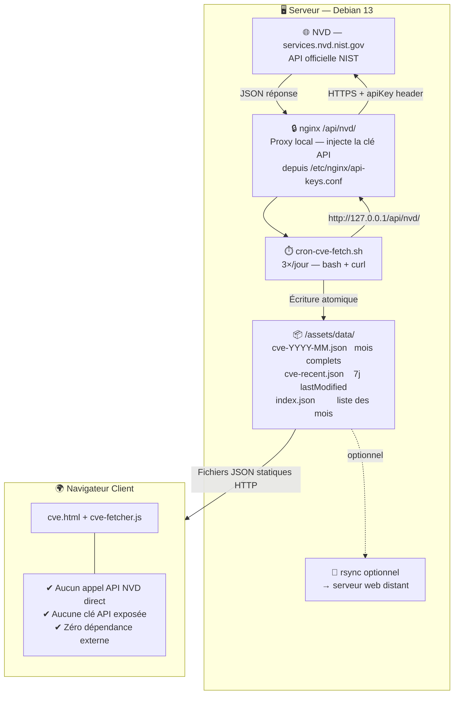

<div align="center">

  <br></br>

  <a href="https://github.com/0xCyberLiTech">
    
  </a>

  <br></br>

  <h2>Laboratoire numérique pour la cybersécurité, Linux & IT.</h2>

  <p align="center">
    <a href="https://0xcyberlitech.github.io/">
      
    </a>
    <a href="https://github.com/0xCyberLiTech">
      
    </a>
    <a href="https://0xcyberlitech.com/cve.html">
      
    </a>
    <a href="https://github.com/0xCyberLiTech?tab=repositories">
      
    </a>
  </p>

</div>

<div align="center">
  
</div>

<div align="center">
  <p>
    <strong>Cybersécurité</strong>  • <strong>Linux Debian</strong>  • <strong>NVD / CVSS</strong> 
  </p>
</div>

---

<div align="center">

## À propos & Objectifs.

</div>

**CVE Tracker** est un tableau de bord de surveillance des vulnérabilités en production, alimenté par le flux officiel **NVD (National Vulnerability Database)** du NIST.

L'objectif : afficher en temps réel les CVE publiées avec leurs scores CVSS, références exploit, entrées CISA KEV et évolution temporelle — sans aucun appel API depuis le navigateur.

### Ce que fait ce projet

- 📡 **Collecte automatique** — un script cron récupère les CVE 3 fois par jour via l'API NVD
- 🔒 **Clé API côté serveur** — stockée dans nginx, jamais exposée au navigateur ni dans les scripts
- 📦 **Fichiers JSON statiques** — servis directement par Apache/nginx, zéro dépendance externe
- 📊 **Dashboard interactif** — filtres sévérité, tri CVSS/date/ID, export CSV, graphique d'évolution
- 🕐 **Mises à jour récentes** — fenêtre glissante 7 jours sur `lastModified` NVD

### Démo live

> 🔴 [https://0xcyberlitech.com/cve.html](https://0xcyberlitech.com/cve.html)

---

## Architecture



### Principe de sécurité clé : la clé API ne quitte jamais le serveur

```nginx
# /etc/nginx/api-keys.conf  (ne JAMAIS versionner ce fichier)
set $nvd_api_key "votre-cle-api-ici";
```

```nginx
# Proxy NVD — accessible uniquement depuis localhost
location /api/nvd/ {
    allow 127.0.0.1;
    deny all;
    proxy_pass https://services.nvd.nist.gov/rest/json/cves/2.0/;
    proxy_set_header apiKey $nvd_api_key;
    proxy_hide_header apiKey;
}
```

Le script cron interroge `http://127.0.0.1/api/nvd/` — nginx injecte la clé et la masque en retour. **Ni le navigateur ni les logs applicatifs ne voient la clé.**

---

## Contenu du dépôt

```
CVE/
├── README.md
├── CHANGELOG.md
├── scripts/
│   ├── cron-cve-fetch.sh        # Collecte quotidienne (3×/jour)
│   ├── backfill-cve.sh          # Backfill historique (1 seule fois)
│   └── nginx-nvd-proxy.conf     # Exemple config proxy nginx
└── docs/
    └── data-format.md           # Format des fichiers JSON générés
```

---

## Installation

### 1. Prérequis

```bash
apt-get install curl jq python3 nginx
```

### 2. Clé API NVD (gratuite)

Obtenir une clé sur [https://nvd.nist.gov/developers/request-an-api-key](https://nvd.nist.gov/developers/request-an-api-key)

| Mode | Quota |
|------|-------|
| Sans clé | 5 req / 30 s |
| Avec clé | 50 req / 30 s |

### 3. Configurer nginx

```bash
# Créer le fichier de clé (ne jamais versionner)
echo 'set $nvd_api_key "VOTRE_CLE_NVD";' > /etc/nginx/api-keys.conf
chmod 600 /etc/nginx/api-keys.conf

# Inclure le proxy dans votre vhost
# Copier le bloc de scripts/nginx-nvd-proxy.conf dans votre vhost

nginx -t && systemctl reload nginx
```

### 4. Déployer les scripts

```bash
mkdir -p /opt/cve-tracker
cp scripts/cron-cve-fetch.sh /opt/cve-tracker/
cp scripts/backfill-cve.sh   /opt/cve-tracker/
chmod 700 /opt/cve-tracker/*.sh

# Adapter DATA_DIR dans les scripts
# DATA_DIR=/var/www/html/assets/data
```

### 5. Backfill historique (1 seule fois)

```bash
/opt/cve-tracker/backfill-cve.sh >> /var/log/cve-backfill.log 2>&1
```

### 6. Cron automatique

```bash
# /etc/cron.d/cve-fetch
0  6 * * * root /opt/cve-tracker/cron-cve-fetch.sh >> /var/log/cve-fetch.log 2>&1
0 13 * * * root /opt/cve-tracker/cron-cve-fetch.sh >> /var/log/cve-fetch.log 2>&1
0 21 * * * root /opt/cve-tracker/cron-cve-fetch.sh >> /var/log/cve-fetch.log 2>&1
```

---

## Format des données

### `cve-YYYY-MM.json`

Tableau JSON de vulnérabilités NVD au format CVE 2.0 :

```json
[
  {
    "cve": {
      "id": "CVE-2025-XXXXX",
      "published": "2025-01-15T10:00:00.000",
      "lastModified": "2025-01-16T08:00:00.000",
      "vulnStatus": "Analyzed",
      "descriptions": [
        { "lang": "en", "value": "Description de la vulnérabilité..." }
      ],
      "metrics": {
        "cvssMetricV31": [{
          "cvssData": {
            "baseScore": 9.8,
            "baseSeverity": "CRITICAL",
            "vectorString": "CVSS:3.1/AV:N/AC:L/PR:N/UI:N/S:U/C:H/I:H/A:H"
          }
        }]
      },
      "references": [
        { "url": "https://...", "tags": ["Exploit", "Third Party Advisory"] }
      ]
    }
  }
]
```

### `index.json`

Index des mois disponibles, généré automatiquement :

```json
{
  "generated": "2025-04-05T06:00:00Z",
  "months": ["2025-04", "2025-03", "2025-02", "2025-01", "2024-12"]
}
```

### `cve-recent.json`

CVE modifiées sur les 7 derniers jours glissants, triées par `lastModified` décroissant. Même format que les fichiers mensuels.

---

## Fonctionnalités du dashboard

| Fonctionnalité | Détail |
|----------------|--------|
| **Filtres sévérité** | CRITICAL / HIGH / MEDIUM / LOW |
| **Tri** | Par date, score CVSS, ID CVE |
| **Recherche** | Plein texte sur ID, description, CWE |
| **Période** | Sélecteur mois/année |
| **Mises à jour récentes** | CVE modifiées sur 7j (NVD lastModified) |
| **Export CSV** | Toutes les CVE filtrées |
| **Métriques** | CVSS moyen, taux exploit, CISA KEV, CWE dominant |
| **Graphique** | Évolution quotidienne des publications |
| **Répartition** | Barre de proportion CRITICAL/HIGH/MEDIUM/LOW |
| **Indice de risque** | Score composite pondéré par sévérité |

---

## Sécurité — ce qui n'est pas dans ce dépôt

```
✔  Aucune clé API NVD
✔  Aucune IP ou hostname d'infrastructure
✔  Aucun fichier JSON de données CVE (données live)
✔  Aucun token, mot de passe ou clé SSH
✔  Les chemins sont génériques — à adapter à votre serveur
```

---

<div align="center">

<table>
<tr>
<td align="center"><b>🖥️ Infrastructure &amp; Sécurité</b></td>
<td align="center"><b>💻 Développement &amp; Web</b></td>
<td align="center"><b>🤖 Intelligence Artificielle</b></td>
</tr>
<tr>
<td align="center">
  
</td>
<td align="center">
  
</td>
<td align="center">
  
</td>
</tr>
</table>

<br/>

<b>🔒 Un projet proposé par <a href="https://github.com/0xCyberLiTech">0xCyberLiTech</a> • Développé en collaboration avec <a href="https://claude.ai">Claude AI</a> (Anthropic) 🔒</b>

</div>
